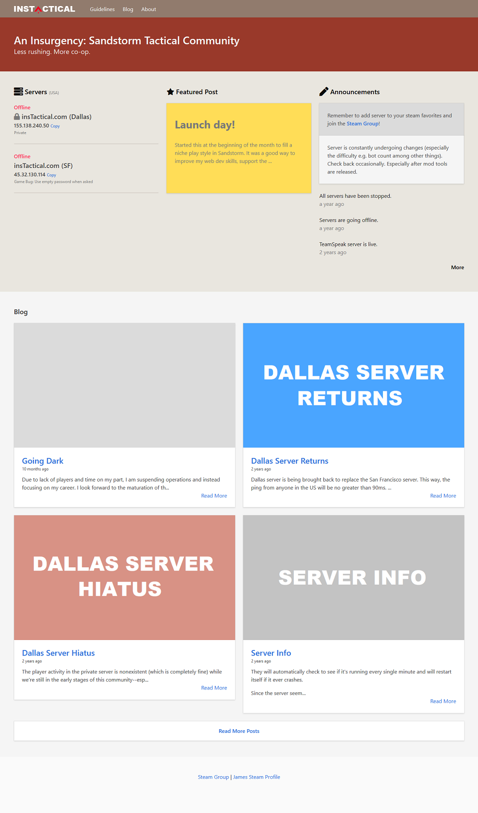
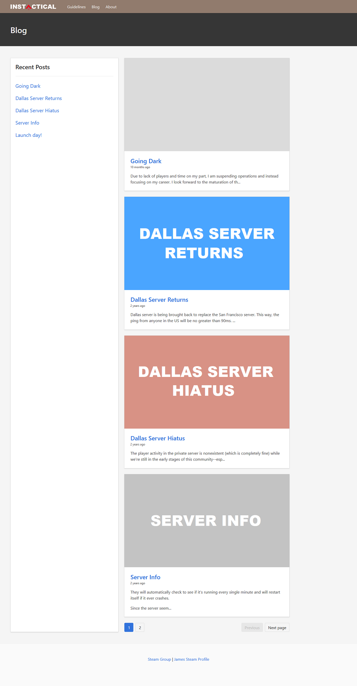
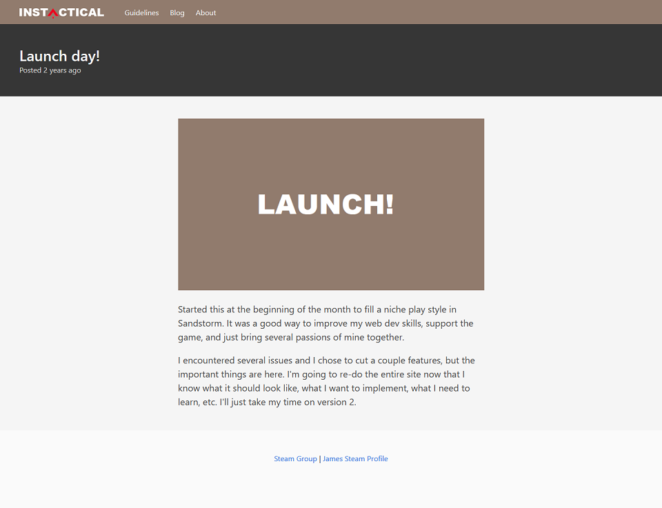
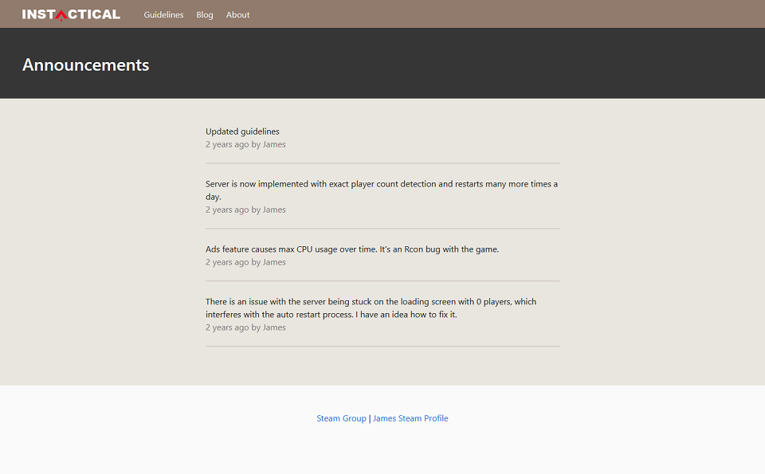

# insTactical v1
Insurgency: Sandstorm Community Server Website  
Third major attempt at making a website. Created in about a month in January 2019 to coincide with the major content update noted by the developers to release in February 2019. Insurgency: Sandstorm released on December 12, 2018.

## Timeline
* 2018-12-12 Sandstorm releases
* 2019-01-30 insTactical website launches
* 2019-02-28 Major content releases

## Tech Stack
* Back end
  * Node
  * MongoDB
* Front end
  * Edge templating
  * Bulma CSS framework

## 2021 Recap and code review

* Very disorganized code - index.js
  * Separate code into modules in different files and folders
  * Create an API to decouple front end and back end
* Hard coding database password - index.js
  * Use environment variables

#### Home

#### Blog

#### Blog Detail

#### Announcements

